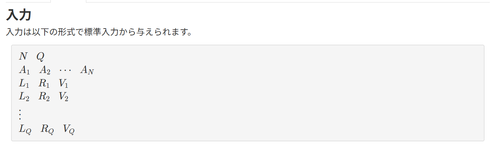

こんな感じで入力が与えられる。
区画の数がN、地殻変動が起こる回数がQ
L_1, R_1, V_1が１回の地殻変動の１セット。
L, Rが今回の地殻変動で標高が変化する区画の端
Vが標高が具体的にどれくらい変化するか。ちなみにマイナスもあり得る。


なので不便さを求める。

## 考える
配列Aを階差数列にすれば、地殻変動が起こったときに変化するのが、インデックスL-2とR-1だけになる。
不便さはあらかじめsum関数で求めておいて、毎回足し合わせていく
階差数列になったことで、要素数がNからN-1になったことに留意しつつ、境界条件ではどうなるのかも把握しつつ、進める

一回の地殻変動内での処理でしたいことはSの更新、出力、Bの更新
Sを更新するためには更新前のBが必要なのでSから先にしていく。
具体的にすることとしては、唯一変更される左端と右端に分けて考え、変更前のB[端]で引き、その後変更後のB[端]を足す。

次に右側をどうしたらいいのかを考える。
右側で変化するのはR=3だとしたら、階差数列のインデックスは2のやつが変わる。なのでB[R - 1]に対して左側と同じ処理をしてあげればいい

### sum関数の使い方
イテラブルって言って、for i in の後ろに来れるやつだったらなんでもsum関数は引数にできる
```
# ✅ 受け取れる（すべて「イテラブル」）
sum([1, 2, 3])              # リスト
sum((1, 2, 3))              # タプル
sum({1, 2, 3})              # セット
sum(abs(b) for b in B)      # ジェネレータ ← ここ！
sum(range(5))               # range オブジェクト

# ❌ 受け取れない
sum(5)  # int は iterable ではない → TypeError
```