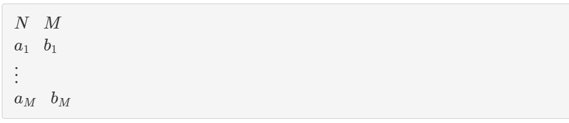

辺の数は10^5に収まるから全部参照することはできる。

タプルのリストを作ってfor文で一個ずつ取り出す。
もし、set内に存在しなければmax側をsetに入れる。かつcount[i - 1] = 1
存在すでにするのならcount[i - 1] = 0
最後にsum(count)これで行く
[0] * Nの配列を作って、count[i - 1]
## 解く
1. 入力受付
2. 上のロジック実装
   

### 2. 上のロジック実装
setの検索ってどうするんだっけ？Python
```
if "あにまる" in my_set:
    
```

次解くのなら、setは使わず、
```
print(sum(1 for c in cnt if c == 1))
```
でいい。
sum(1 for c in count if c == 1)